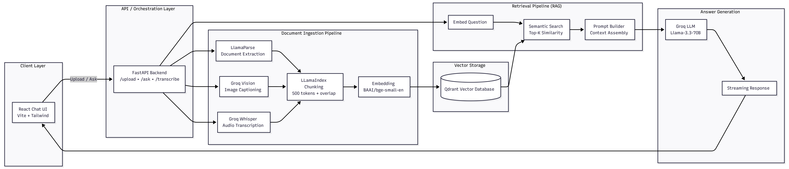

# DocQuery — Document-Based Q&A System

An intelligent document assistant that lets you upload files, index their content with semantic embeddings, and ask natural-language questions — getting answers synthesized from your own documents.

---

## Features
- Multi-format file upload (PDF, TXT, CSV, XLSX, DOCX, images, audio)
- Semantic search using embeddings + vector DB
- LLM-generated answers (Groq)
- Streaming responses
- Image understanding + audio transcription
- Cross-document reasoning

---

## Architecture



## Tech Stack

| Layer | Technology |
|------|------------|
| LLM | Groq (llama-3.3-70b) |
| Embeddings | bge-small-en |
| Chunking | LlamaIndex SentenceSplitter |
| Vector DB | Qdrant |
| Parsing | LlamaParse |
| Backend | FastAPI |
| Frontend | React + Vite |
| Infra | Docker Compose |

---
# SetUp Instructions
## Prerequisites

- **Docker & Docker Compose** (recommended) or **Docker Desktop**, or:
  - Python 3.11+
  - Node.js 18+ / [Bun](https://bun.sh/) 1.0+
- **API Keys** (free tiers available):
  - [Groq API Key](https://console.groq.com/) — for LLM, vision, and transcription
  - [LlamaParse API Key](https://cloud.llamaindex.ai/) — for document parsing

---

## Getting Started
 
### Option 1: Docker Compose (Recommended)
 
```bash
git clone https://github.com/Amadabh/docquery.git
cd docquery
cp backend/.env.example backend/.env
# add GROQ_API_KEY + LLAMA_PARSE_KEY
docker compose up --build
```
 
### Services
 
| Service  | URL                        |
| -------- | -------------------------- |
| Frontend | http://localhost:5173      |
| Backend  | http://localhost:8000      |
| Qdrant   | http://localhost:6333      |
 
---
 
### Option 2: Local Development
 
#### 1. Start Qdrant
 
```bash
docker run -p 6333:6333 \
  -v $(pwd)/qdrant_storage:/qdrant/storage \
  qdrant/qdrant
```
 
---
 
#### 2. Start Backend
 
```bash
cd backend
python -m venv .venv
source .venv/bin/activate
pip install -r requirements.txt
cp .env.example .env
uvicorn main:app --reload --port 8000
```
 
> ⚠️ **Note:** On first run, the embedding model (`BAAI/bge-small-en`) is downloaded via FastEmbed.
> Wait until you see **"Application startup complete"** (~30–60s). After that, it is cached and starts quickly.
 
---
 
#### 3. Start Frontend
 
```bash
cd frontend
bun install   # or npm install
bun run dev
```
 
Open: http://localhost:5173

## Usage
Upload documents via the 📎 icon, then ask questions in chat. The system retrieves relevant context using embeddings and streams LLM-generated answers. Voice input is also supported via 🎤 microphone.

---

## Example Use Cases
- “What is CBT therapy?”
- “What accommodations can students request?”
- “Summarize all uploaded documents”
- Cross-document reasoning questions
